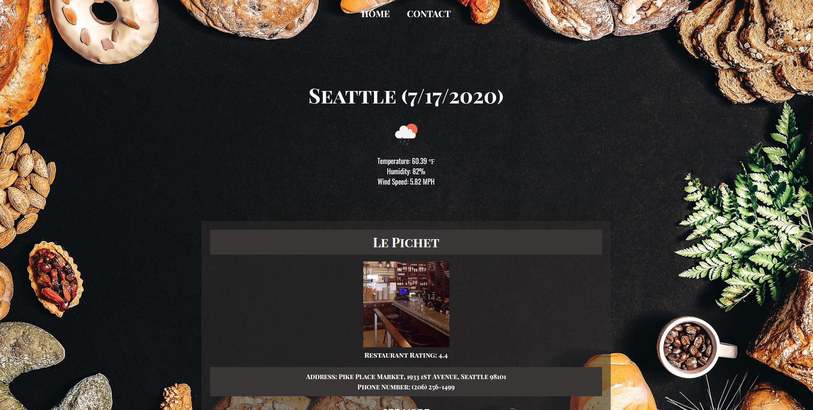
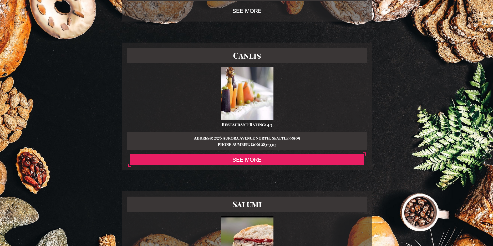
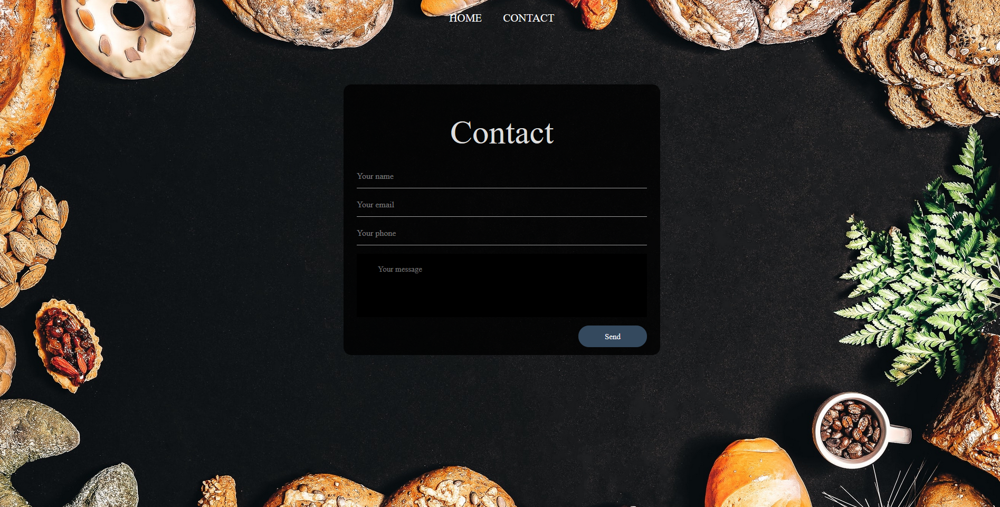

# Send-foodz
Create a simple app that will show restuarant reviews with description to help the user research.

## Links
Deployed Webpage: https://ktlnn.github.io/send-foodz/

## Table of Contents
- [User Story](#user-story)
- [Flow](#flow)
- [Technologies Used](#technologies-used)
- [Webpage Screenshots](#webpage-screenshots)

## User Story
```
AS a person who loves good food and is not familiar with all the restuarants around
I need help deciding where to eat good food.
```
## Flow
```
GIVEN I am deciding where to eat 
Search for a location
WHEN I press enter at the search bar
THEN the search results will appear on cards
WHEN the search criteria is of a city
THEN the cards show restaurants and the weather in the area
WHEN the see more link of the card is clicked
THEN I will be taken to the restaurant page on zomato
If I click on the contact page 
It will take me to a page where I could leave contact info and a message
If i click the home button on the top it will take me to the home page
```

## Technologies Used
- Zomato API
- OpenWeather API

## Webpage Screenshots 







